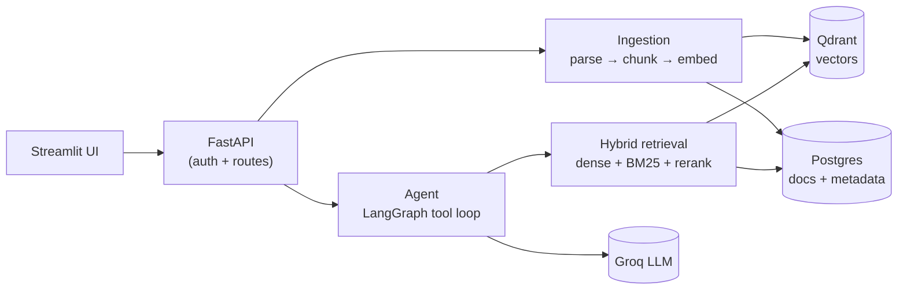

# Architecture

Hexagonal / clean architecture: `packages/domain` has zero knowledge of Qdrant, Postgres, or
which LLM vendor is active. `packages/application` defines use cases plus the ports
(interfaces) those use cases depend on; `packages/infrastructure` provides the adapters that
implement those ports. `apps/api` and `apps/ui` are entry points that wire everything together
through a composition root — swapping the LLM provider or the vector store is a contained
change inside one adapter, not a rewrite.

**Two core flows** (see the [README](../README.md#architecture) for the full write-up):

1. **Ingestion** — upload → parse → guardrail screen → chunk (clause/section-aware) → embed
   (`fastembed`, dense + BM25 sparse) → vectors into Qdrant, metadata + text into Postgres.
2. **Agentic query** — question → guardrail screen → `ComplianceAgent` (LangGraph loop against
   Groq) picks from `retrieve_chunks`, `compare_regulations`, `generate_action_items`,
   `summarize_regulation` → answer is guardrail-screened → every claim cited back to a source
   clause.
